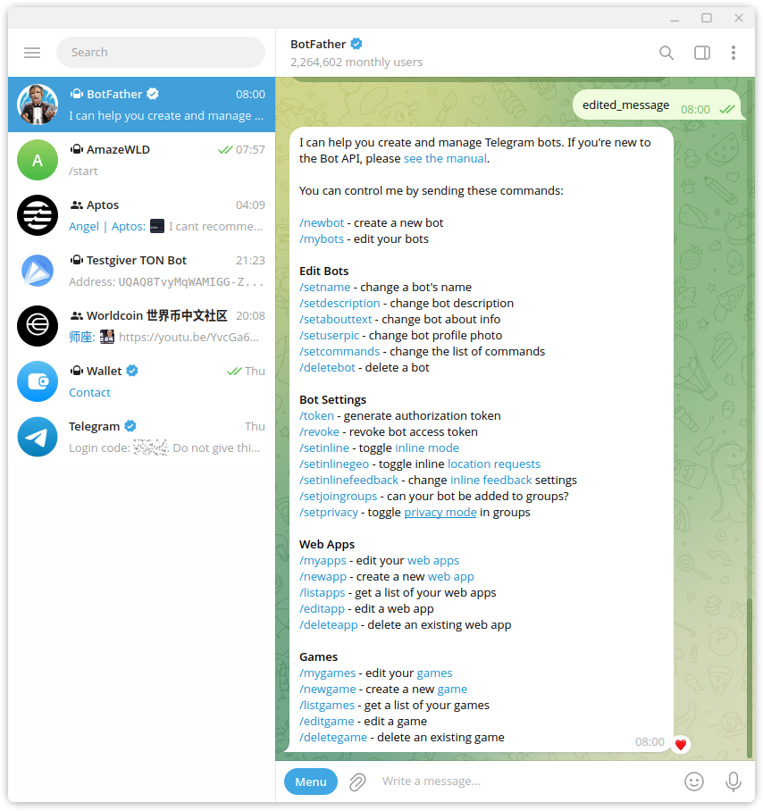

# Telegram 小程序 & 机器人 & Games

## [教程](https://core.telegram.org/bots/webapps)
* [Telegram bot 和 mini apps 开发简易教程](https://github.com/brickspert/blog/issues/65)

# Telegram Bot
* Telegram 搜索 `BotFather` 蓝标
* 输入 `/newbot` 创建第一个 Bot
* 输入 项目名称
* 输入 Bot Name，以 `bot` 结尾
* 得到一个 access token

# Telegram Mini App
* 输入 `/newapp` 创建第一个 Mini App
  - 一个bot可以对应多个app
* 唯一链接 
  - 一个bot可以对应多个app

# Telegram Games
* 输入 `/newgame ` 创建第一个 Games

## DEV [开发教程](https://github.com/yagop/node-telegram-bot-api)

* `npm i node-telegram-bot-api`
* `npm install --save-dev @types/node-telegram-bot-api`